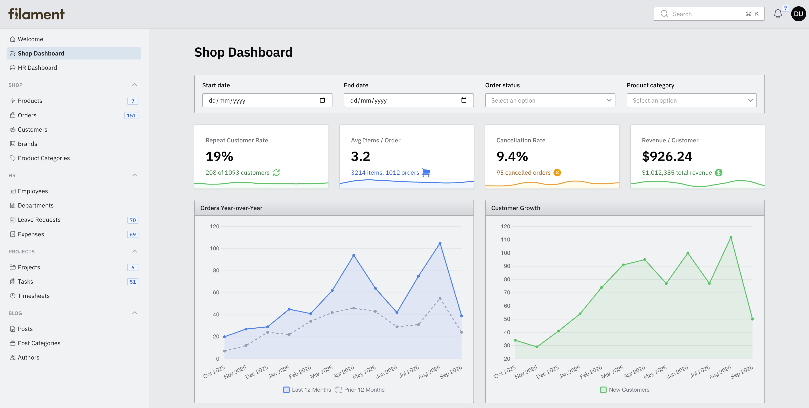
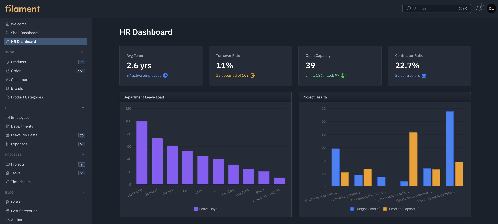
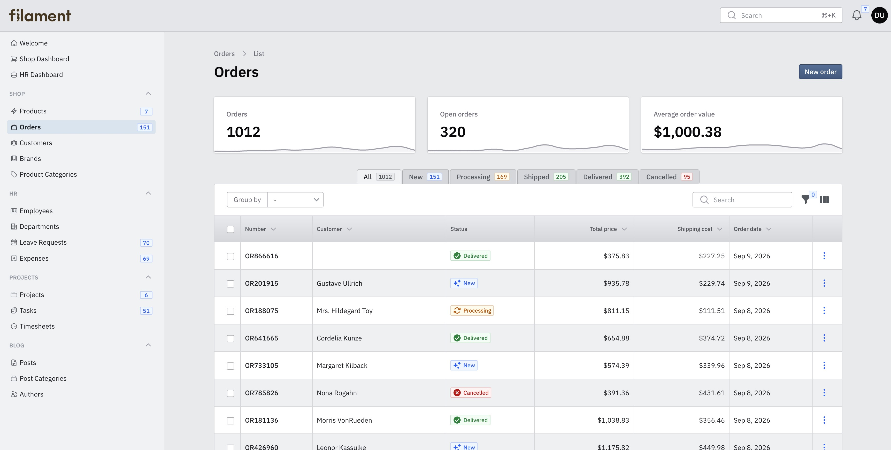
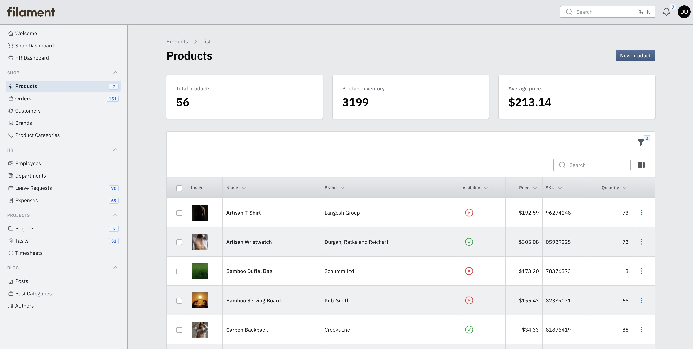
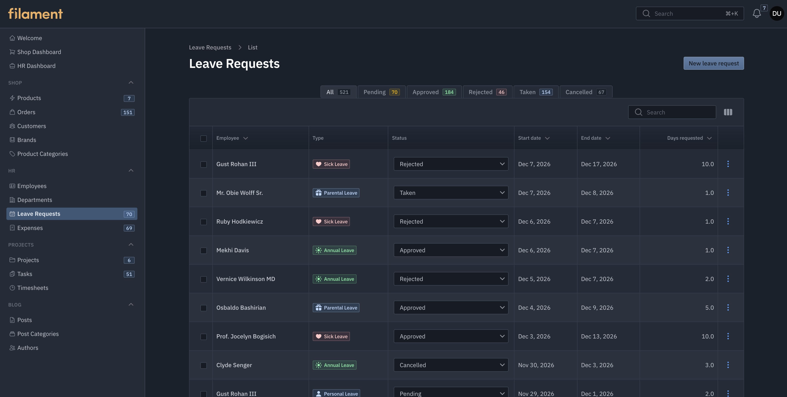
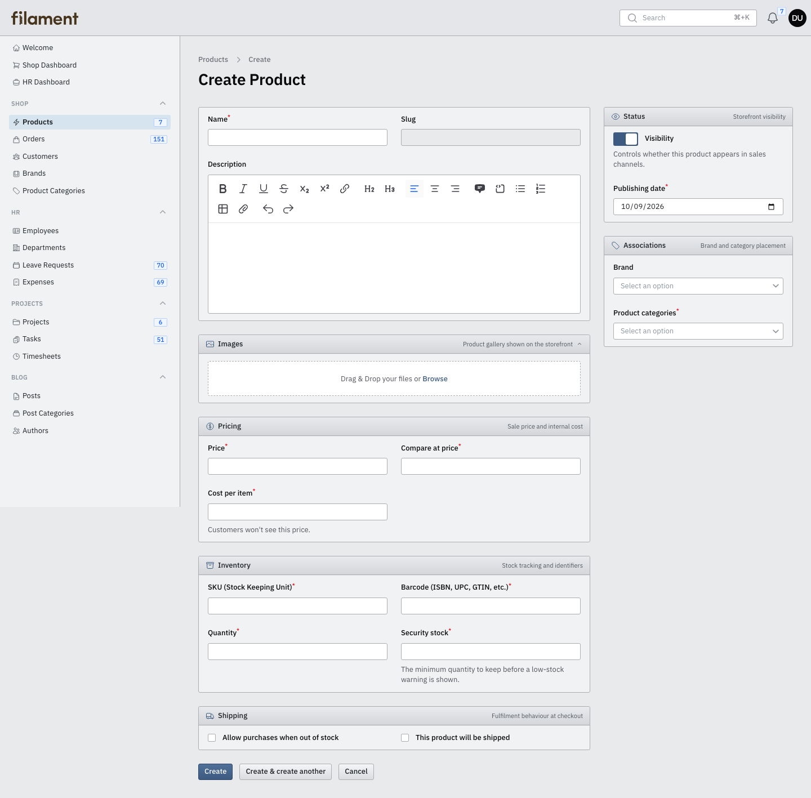

# Filament Qt5 Theme

A Qt5-inspired desktop theme for Filament panels. Supports Filament v4 and v5.

## Screenshots








## Installation

```bash
composer require khwr/filament-qt5-theme
```

Register the plugin on your panel:

```php
use Khwr\FilamentQt5Theme\FilamentQt5ThemePlugin;

public function panel(Panel $panel): Panel
{
    return $panel
        ->plugin(FilamentQt5ThemePlugin::make());
}
```

Publish the compiled assets:

```bash
php artisan filament:assets
```

## Development

CSS source lives in `resources/css`. Build the published stylesheet with:

```bash
npm install
npm run build
```

## License

MIT. See [LICENSE.md](LICENSE.md).
